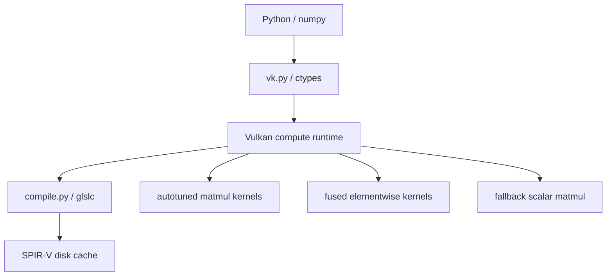

# vkgrad
A training stack for GPUs that aren't NVIDIA, built on Vulkan compute.

<!-- TODO: screenshot or GIF of examples/mnist.py racing the CPU, above the fold. -->

**Result:** a 315.4M-parameter transformer trains on an integrated laptop GPU, in 7.31 GiB, with no CUDA and no ROCm
**Stack:** Vulkan compute · SPIR-V · GLSL · cooperative matrix · Python · ctypes · numpy
**Run it:** `python -m examples.mnist --synthetic`

## The problem

CUDA is the only mature training stack. Everything else is inference-only or vendor-locked.
Vulkan's cooperative matrix extension exposes matrix-multiply hardware on AMD, Intel, NVIDIA,
Qualcomm and ARM, across operating systems, and it was already being used for inference by
llama.cpp and ncnn. Nothing ran a **backward pass** on it. This does.

## Results

Measured on an AMD Radeon 780M (RDNA3 iGPU, 12 CU) under Windows, where ROCm does not officially
reach. Raw numbers in [bench/RESULTS.md](bench/RESULTS.md), the write-up is [RESEARCH.md](RESEARCH.md).

| | |
|---|---|
| MNIST, full training run | **97.6%** test accuracy (5 runs: 97.51 to 97.78) in 1.6 s of wall time |
| against the CPU sharing the same die and DRAM | **5.3x** faster (5 runs: 4.90 to 5.65) |
| largest model trained | **315.4M** parameters in 7.31 of 11.8 GiB |
| sustained throughput, 12-minute run | **21,382 tokens/s** |

At a Chinchilla-optimal 20 tokens per parameter, that sustained rate puts a 10.8M-parameter model
at **2.8 hours**. An earlier figure of 2.6 hours was extrapolated from best-of-four step times and
runs about 7% optimistic; every time-to-train number in section 40 of `bench/RESULTS.md` should be
read as roughly 7% longer. Nothing here is inference: full forward, backward and AdamW, with every
gradient verified against numpy.

## The design decision that was actually hard

**Tensors are numpy arrays and GPU buffers at the same time, and unified memory does not mean
"never copy".** On this APU, host-visible memory runs at 86% of device-local read bandwidth (68.70
vs 79.75 GB/s), a staging upload costs 23.16 GB/s one-way on top of that, and CPU reads from
write-combined memory are **73x slower** than from cached memory.

So there is no single right answer, and the allocator refuses to pick one. Placement is chosen per
tensor by role: input batches are zero-copy, weights are device-local because the staging cost
amortises over the whole run, and the loss lives in host-cached memory because the CPU reads it
every step. The allocator exposes `shared` / `device` / `cached` instead of a global policy.

## Architecture



## Layout

```
vk.py              Vulkan compute runtime via ctypes. No SDK bindings, no C compiler.
compile.py         GLSL -> SPIR-V via glslc, content-hashed disk cache
kernels.py         matmul generators (direct + LDS), fused elementwise kernels, autotuner
autograd.py        tape, Linear/MLP, fused AdamW, recorded TrainStep
tkernels.py        LayerNorm, causal attention softmax, head permutes, embeddings
transformer.py     decoder-only transformer: attention, blocks, GPT
fallback.py        scalar tiled matmul for GPUs with no matrix units
dataparallel.py    DDP over shared host memory: replicated weights, atomic gradient arena
check_device.py    will vkgrad run on this GPU, and what will it get
examples/mnist.py  trains an MLP, races it against the same model on the CPU
```

## State

| phase | status |
|---|---|
| 0. toolchain | done. Vulkan SDK, `glslc` compiles `GL_KHR_cooperative_matrix` |
| 1. runtime + zero-copy allocator | done, verified |
| 2. WMMA matmul + autotuner | done, verified. Forward and both backward transposes |
| 3. autograd + training | done. MNIST 97.69%, and a 1.84M param transformer trains |
| 4. multi-device without NCCL | mechanism verified: DDP over shared host memory, 0 bytes transferred |
| 5. runs without matrix units | scalar fallback, exact vs numpy, ~6% slower on a real step |

## Running the tests

```bash
python check_device.py        # will this GPU work, and what will it get
python test_runtime.py
python test_kernels.py
python test_autograd.py
python test_transformer.py
python test_shared.py
python test_accum.py
```

Set `VKGRAD_NO_COOPMAT=1` to force the scalar path and check the fallback on hardware that has
matrix units.

## Limitations

- **The Vulkan 1.1 target is claimed, not yet demonstrated.** The runtime negotiates features down
  to 1.1, but `compile.py` currently emits SPIR-V targeting Vulkan 1.3. Lowering the target changes
  the emitted binary for every shader, so it is a measured change, not a flag flip. No 1.1 device
  has run this suite.
- **Every shader here has only ever run on one physical GPU.** Cross-vendor support is a design
  intention, not a test result.
- **Matrix units are worth less than the peak numbers imply.** On a real training step, cooperative
  matrix is worth between -5% and +18% depending on model shape, median around 8%, rather than the
  2.9x the peak FLOPS suggest. The scalar fallback runs exact against numpy and costs about 6%.
- Above roughly 85M parameters, training from scratch stops being practical on this hardware
  (7 days and rising), though the models still fit and still run, so fine-tuning at those sizes
  remains on the table.
